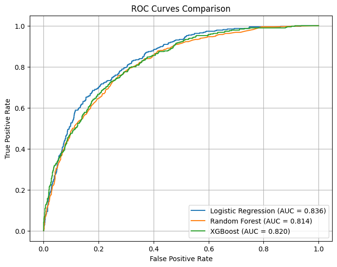

# ML-Based Churn Prediction Web App

In this project, I applied machine learning models to customer churn prediction and implemented a full-stack solution for deployment.  
The end product is a web application that allows users to calculate the churn probability for a customer based on selected features.  

This project has strong real-world applicability, as accurate churn prediction is a key component of data-driven marketing strategies and customer retention initiatives.

---

## Table of Contents
- [Project Overview](#project-overview)
- [Dataset](#dataset)
  - [Feature Overview](#feature-overview)
  - [Data Analysis](#data-analysis)
  - [Data Preprocessing](#data-preprocessing)
- [Modeling](#modeling)
  - [Model Parameters](#model-parameters)
    - [Logistic Regression](#logistic-regression)
    - [Random Forest](#random-forest)
    - [XGBoost](#xgboost)
  - [Threshold Optimization](#threshold-optimization)
  - [Evaluation Metrics](#evaluation-metrics)
- [Results](#results)
  - [Model Comparison](#model-comparison)
  - [Visual Results](#visual-results)
  - [Key Observations](#key-observations)
- [Backend](#backend)
  - [Features](#features)
  - [Key Files](#key-files)
  - [Running Locally](#running-locally)
- [Frontend](#frontend)
- [Deployment](#deployment)
- [Potential Improvements](#potential-improvements)
- [License](#license)


---

## Project Overview

Customer churn occurs when a customer stops using a company’s product or service. Accurately predicting churn helps businesses identify high-risk customers early, allowing them to take proactive retention actions—such as offering special discounts, personalized support, or loyalty incentives.

This project evaluates and compares the performance of three machine learning models for predicting churn:

- **Logistic Regression**
- **Random Forest**
- **Extreme Gradient Boosting (XGBoost)**

A full-stack application was built around the Logistic Regression model and it was deployed at:

**https://churnprediction-api.onrender.com/**  
*Note: The free Render tier may enter sleep mode when inactive, so the initial load time may be slow.*


## Dataset

The dataset used to train and evaluate the models comes from the Telco Customer Churn dataset on Kaggle:  
**https://www.kaggle.com/datasets/blastchar/telco-customer-churn**

This dataset contains detailed information about customer accounts. Each row represents a single customer, and each column corresponds to an attribute describing their demographics, subscription details, service usage, or billing behavior.

The raw dataset includes **7,043 customers** and **21 features**.

The target variable is:

- **`Churn`** — a binary indicator indicating whether the customer discontinued the service.

### Feature Overview

Some of the key features include:

- **Demographics:** `gender`, `SeniorCitizen`, `Partner`, `Dependents`  
- **Service-related:** `tenure`, `PhoneService`, `MultipleLines`, `InternetService`, `OnlineSecurity`,  
  `OnlineBackup`, `DeviceProtection`, `TechSupport`, `StreamingTV`, `StreamingMovies`
- **Contract & Billing:** `Contract`, `PaperlessBilling`, `PaymentMethod`
- **Financial:** `MonthlyCharges`, `TotalCharges`

### Data Analysis

The project began with an exploratory data analysis (EDA), documented in **/notebooks/01_eda.ipynb**.  
The analysis focused on understanding the structure of the data, identifying key patterns, and uncovering the drivers of customer churn.

The EDA included:

- **Summary statistics for numerical features**
- **Distribution analysis of variables such as `tenure` and `MonthlyCharges`**
- **Exploration of relationships between churn and key customer attributes**

The key findings included:

- **Fiber optic customers show noticeably higher churn rates**, suggesting potential dissatisfaction or service-related issues.
- **Customers using electronic check as their payment method churn at significantly higher rates** compared to other payment types.
- **Month-to-month contract customers are the most likely to churn**, highlighting the importance of long-term contracts in customer retention.


### Data Preprocessing

The data preprocessing was performed in **/notebooks/file 02_feature_engineering.ipynb**.
The data was surprisingly clean, only a couple of rows had to be dropped due to missing values in the feature TotalCharges. Additionally, the CustomerID was dropped because it carries no predictive value.

The dataset contains a mix of categorical and numerical features, which required separate handling. The numerical features were normalized by applying **StandardScaler** from the scikit-learn library. The categorical features were encoded with the **one-hot encoder**, also from the scikit-learn library. The data processing pipeline was saved for later use by applying the Python's joblib library. 

The data was split into training and testing datasets by applying the **train_test_split** - function from scikit-learn. The test dataset was given 20 % of the data and rest was put into the training dataset. The target (churn) and features were also separated, yielding four datasets in total (X_test, X_train, y_test, y_train). These datasets were saved in the \data\processed - folder to be used in the modeling.
 

## Modeling

The modeling process was conducted in **/notebooks/03_modeling.ipynb**.

Three machine learning models were trained and compared to predict customer churn probability:

- **Logistic Regression**
- **Random Forest**
- **Extreme Gradient Boosting (XGBoost)**

The Logistic Regression and Random Forest models were implemented using the scikit-learn library, and the XGBoost model was implemented using the XGBoost library.

### Model Parameter Choices

Each model was configured with parameters selected to balance performance, interpretability, and computational efficiency:

#### **Logistic Regression**
- **max_iter=1000**
   I chose to increase max_iter beyond the default to ensure convergence after one-hot encoding expands the feature space.  
- **random_state=42**
   Added a random number seed to ensure reproducibility. 

Logistic Regression serves as a strong, interpretable baseline model and is easy to deploy due to its simplicity.

#### **Random Forest**
- **n_estimators=200** 
   Provides a robust ensemble size without excessive training time.  
- **max_depth=None**
   This selection allows trees to grow fully, enabling the model to capture complex structures.  
- **n_jobs=-1**
   Utilizes all CPU cores for faster computation.  
- **random_state=42**
    Reproducibility.

This configuration offers strong predictive performance while maintaining robustness against overfitting.

#### **XGBoost**
- **n_estimators=200** – Specifies the number of boosting rounds, offering a solid trade-off between performance and speed.  
- **max_depth=5** – Restricts tree complexity to prevent overfitting while capturing non-linear patterns.  
- **learning_rate=0.1** – A standard, stable learning rate that works well in boosted trees.  
- **subsample=0.8** – Uses 80% of the training samples per tree to improve generalization.  
- **colsample_bytree=0.8** – Uses 80% of feature columns per tree, reducing overfitting further.  
- **eval_metric='logloss'** – Suitable metric for binary classification with probability outputs.

These hyperparameters form a strong starting point for tabular classification tasks such as churn prediction.

---

### Threshold Optimization

To better reflect business priorities, model evaluation included optimizing the classification threshold rather than relying on the default 0.5 split.  
A custom cost function was defined:

\[
\text{Cost} = 5 \times FN + FP
\]

False negatives (**missed churners**) were weighted five times more heavily than false positives, since losing a customer is more costly than mistakenly flagging one.  
For each model, predicted probabilities were evaluated across a range of thresholds to find the value that minimized this weighted cost.

---

### Evaluation Metrics

Model performance was assessed using three key metrics:

- **ROC–AUC Score**  
  Measures how well the model separates churners from non-churners, independent of any threshold.

- **Weighted F1 Score**  
  Calculated at the optimized threshold. This metric balances precision and recall—especially important for imbalanced datasets where detecting churners is critical.

- **Minimized Weighted Cost**  
  Captures the business impact of misclassifications using the custom cost function above. A lower value indicates better alignment with real-world priorities.

## Installation

The codebase was written with **Python 3.12.6**. Compatibility with other Python versions is not confirmed.

### 1. Clone the repository

```bash
git clone https://github.com/yourusername/your-repo.git
cd ChurnPrediction
```

### 2. Create a virtual environment (Recommended)

```bash
python3 -m venv venv
.\venv\Scripts\activate # Windows
source venv/bin/activate # Linux / macOS
```

### 3. Install Dependencies

```bash
pip install requirements-dev.txt
```
*Note: The requirements.txt file under /app/ is used for deployment. Do not use it for package installation.*

## Results

After training the three models and evaluating them using ROC–AUC, Weighted F1 Score, and the minimized weighted cost, small differences emerged. The ROC-curve was also plotted for all of the models, and it can be found under `/results/`.

### Model Comparison

| Model                | ROC–AUC  | Optimal Threshold | Weighted F1 Score | Minimized Weighted Cost |
|----------------------|----------|-----------------|------------------|------------------------|
| Logistic Regression  | 0.8359   | 0.1569          | 0.6727           | 622                    |
| Random Forest        | 0.8140   | 0.1800          | 0.6812           | 659                    |
| XGBoost              | 0.8201   | 0.0867          | 0.6415           | 657                    |

### Visual Results

<br>
<p align="center">
  
</p>

<br>
<p align="center">
  
</p>


### Key Observations

- **Logistic Regression** achieved the highest ROC–AUC (0.836) and the lowest minimized weighted cost (622). Its strong performance suggests that the relationship between features and churn is largely linear. Logistic Regression is likely the best choice for business-oriented churn prediction due to its interpretability and efficiency.  

- **Random Forest** reached the highest weighted F1 score (0.681) at an optimal threshold of 0.18. While it balanced precision and recall well, its minimized weighted cost (659) was higher than Logistic Regression, indicating slightly more business risk in terms of misclassified high-risk churners.  

- **XGBoost** showed competitive ROC–AUC (0.820) but had a very low optimal threshold (0.087) and a higher cost (657). This indicates that it flagged many customers as potential churners, increasing false positives. Further investigation of feature interactions, hyperparameter tuning, and threshold optimization is recommended to fully leverage XGBoost for this task.

## Backend

The backend is implemented using Python's **FastAPI** library and serves as the API for the churn prediction application.

### Key Features

- Provides a `/predict` **POST endpoint** for predicting customer churn probability.
- Uses **Pydantic models** to validate incoming request data.
- Loads the **preprocessing pipeline** and **trained Logistic Regression model** with `joblib`.
- Applies **CORS middleware** to allow requests from the frontend.
- Serves the frontend with **StaticFiles**.

### Key Files

- `backend/main.py` – FastAPI app, endpoint definitions, and model loading.
- `models/` – Contains the serialized preprocessor and trained model files (`.joblib`).
- `requirements.txt` – Backend dependencies including FastAPI, Pydantic, Pandas, NumPy, Scikit-learn, Joblib, Gunicorn, and Uvicorn.

### Optional: Running the Backend Locally

To run the backend locally:

```bash
# Activate your virtual environment
source venv/bin/activate   # macOS/Linux
venv\Scripts\activate      # Windows

# Start the FastAPI server
uvicorn backend.main:app --reload
```

## Frontend

The frontend is built with **HTML and JavaScript**. It provides input fields for **all customer features** used in the model, allowing users to submit different combinations of feature values and receive the **predicted churn probability** from the backend.  

Key points:  

- Users can interactively test different customer scenarios by changing the input values.  
- The form dynamically sends the input data as a **JSON payload** to the backend `/predict` endpoint.  
- The predicted churn probability is displayed immediately on the page, enabling users to quickly explore different customer risk profiles.  

## Deployment

The project is deployed on **Render** using **Gunicorn** with a single worker.  
You can access the live application here: [https://churnprediction-api.onrender.com/](https://churnprediction-api.onrender.com/)

The free Render plan puts inactive apps to sleep, so the first load may take longer while the server starts.

This deployment demonstrates a **full-stack implementation**, combining a FastAPI backend with a frontend interface, making the churn prediction model accessible without any local setup.

## Potential Improvements

While this project demonstrates effective churn prediction and deployment, it could be further strengthened by analyzing **model convergence** and **overfitting**.  
For example, checking the convergence of the Logistic Regression model would ensure the iterative optimization reached a stable solution after one-hot encoding increased the feature space. Examining overfitting by comparing training and test performance or visualizing learning curves for Random Forest and XGBoost—could help fine-tune the models and improve generalization.  

Additionally, the models were trained with basic parameter choices and **hyperparameter tuning was not extensively performed**. Exploring a wider range of parameters could potentially improve model performance and better align predictions with business objectives. Incorporating these analyses and experiments would provide deeper insights into model reliability and robustness in real-world scenarios.¨

## License

This project is licensed under the **MIT License**.  
See the [LICENSE](LICENSE) file in the repository for full details.